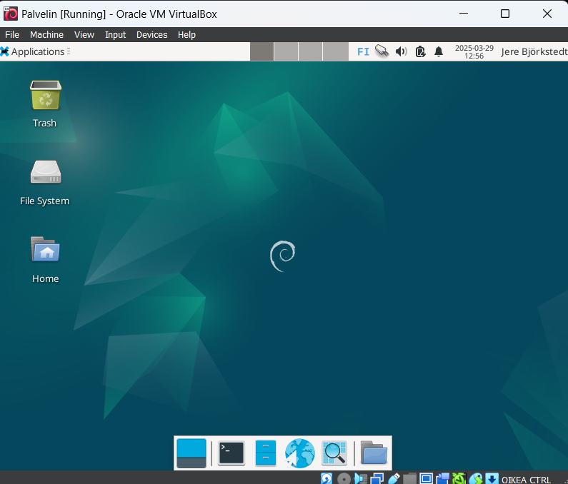
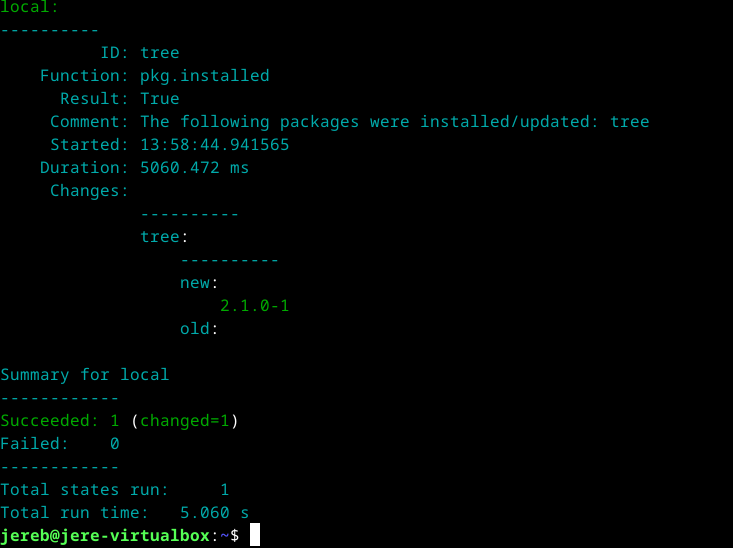
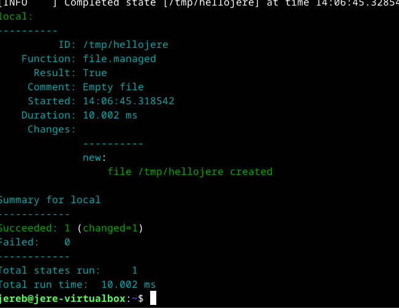
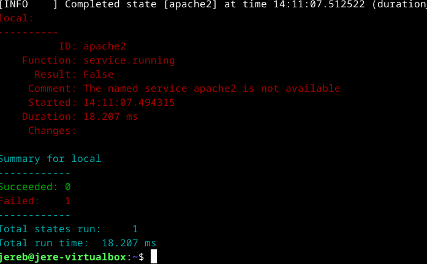
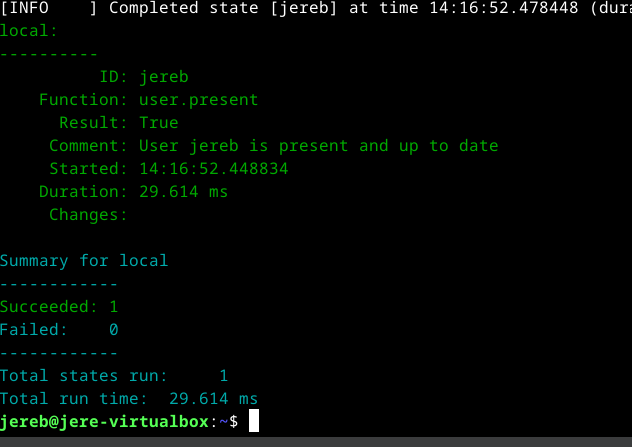
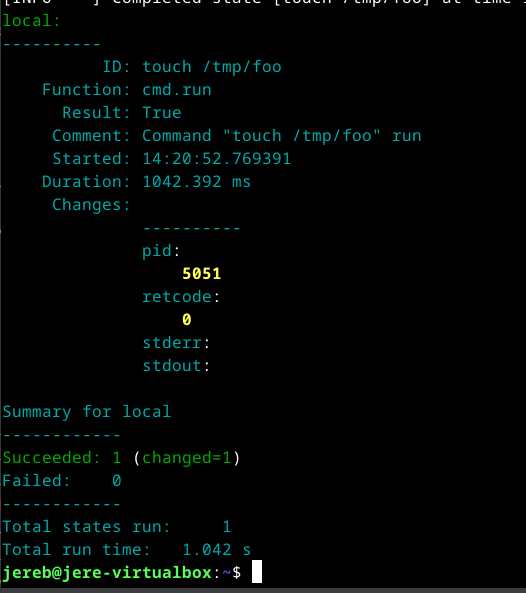

# H1 Viisikko

## Käyttöympäristö

Prosessori: AMD Ryzen 5 5500H

RAM: 8 GB DDR4

Näytönohjain: NVIVIA GeForce RTX 2050

OS: Windows 10

VM: Linux Debian 12 bookworm

## x) Lue ja tiivistä. 

### Karvinen 2023: Run Salt Command Locally 

- Saltin pää tarkoitus on yleensä ohjata suuria määriä orjakoneita verkon yli.
- Tärkeimpiä tilakomentoja ovat `pkg` , `file` , `service` , `user` & `cmd`

### Karvinen 2018: Salt Quickstart – Salt Stack Master and Slave on Ubuntu Linux 

- Ei ole väliä ovatko orjakoneet esim. NATin takana, palomuurin takana, tai tuntemattomassa osoitteessa. Niitä voi hallita silti. Ainoastaan pääpalvelimen pitää olla julkinen.
- Verkossa on yksi pääpalvelin eli "master" ja useita orjakoneita eli "slaves".

### Karvinen 2006: Raportin kirjoittaminen 

- Raportointi tarkoittaa, että kirjoitat täsmällisesti mitä teit ja mitä siitä seuraa.
- Raportti tulee olla **Toistettava** , **Täsmällinen** , **Helppolukuinen** ja **Täytyy viitata lähteisiin**

### WMWare Inc: Salt Install Guide: Linux (DEB)

#### Saltin asennus

  1. Luo tarvittava hakemisto ja lataa julkinen avain.

         # Keyrings hakemisto:
         $ mkdir -p /etc/apt/keyrings
         # Julkisen avaimen lataus
         $ curl -fsSL https://packages.broadcom.com/artifactory/api/security/keypair/SaltProjectKey/public | sudo tee /etc/apt/keyrings/salt-archive-keyring.pgp

  2. Päivitä pakettiluettelo

         $ sudo apt-get update

  3. Lataa salt-minion, salt-master tai joku muita salt-komponentteja.

## a) Asenna Debian 12-Bookworm virtuaalikoneeseen. 

Asensin Debian 12-BookWoermin virtuaalikoneeseen onnistuneesti. 

## b) Asenna Salt (salt-minion) Linuxille

Aloitin tehtävän suorittamalla (WMware, Inc) Ohjeen mukaan lataamalla Saltin: 

Varmistin, että keyrings-hakemisto on olemassa: 

    $ mkdir -p /etc/apt/keyrings 

Julkisen avaimen lataus: 

    $ curl -fsSL https://packages.broadcom.com/artifactory/api/security/keypair/SaltProjectKey/public | sudo tee /etc/apt/keyrings/salt-archive-keyring.pgp 

Loin apt-arkiston repositorion: 

    $ curl -fsSL https://github.com/saltstack/salt-install-guide/releases/latest/download/salt.sources | sudo tee /etc/apt/sources.list.d/salt.sources

Seuraavaksi asensin salt-minionin: 

    $ sudo apt-get update
    $ sudo apt-get -y install salt-minion

##  Viisi tärkeintä. Näytä Linuxissa esimerkit viidestä tärkeimmästä Saltin tilafunktiosta: pkg, file, service, user, cmd. Analysoi ja selitä tulokset. 

### pkg
Aloitin testaamalla esimerkin pkg-tilafunktiosta: 

    $ $ sudo salt-call --local -l info state.single pkg.installed tree 

  

Tilafunktio varmistaa, että jokin paketti on asennettu paikalliselle koneelle. Jos sitä ei ole komento asentaa sen. Vaihtoehtoisesti paketin voi myös poistaa koneelta. 

### File
File: 

    $ sudo salt-call --local -l info state.single file.managed /tmp/hellojere

File tilafunktio varmistaa, että tiedosto on olemassa paikallisessa ympäristössä, jos ei ole niin se luodaan. 

### Service

    $ $ sudo salt-call --local -l info state.single service.running apache2 enable=True

Service tilafunktio varmistaa, että apache2 on käynnissä ja se käynnistyy automaattisesti. Minulla ei kuitenkaan ole apache2 asennettuna, joten se ei toiminut.

### User

    $ sudo salt-call --local -l info state.single user.present jereb

 

User tilafunktio komento tarkastaa onko tietty käyttäjä olemassa, jos ei ole se luodaan. 

### Cmd

    $ sudo salt-call --local -l info state.single cmd.run 'touch /tmp/foo' creates="/tmp/foo"

  Cmd tilfuktio komento varmistaa, ettö jokin tiedosto on olemassa, jos sitä ei ole se luodaan. Jos tiedosto on jo olemassa se ei tee mitään. 
  
    
## Lähteet

- Karvinen, T. 2025. Tehtävänanto. h1 viisikko. Luettavissa: https://terokarvinen.com/palvelinten-hallinta/#h1-viisikko Luettu: 29.3.2025
- Karvinen, T. 28.10.2021. Run Salt Command Locally. Luettavissa: https://terokarvinen.com/2021/salt-run-command-locally/ Luettu: 29.3.2025
- Karvinen, T. 28.3.2018. Salt Quickstart – Salt Stack Master and Slave on Ubuntu Linux. Luettavissa: https://terokarvinen.com/2018/03/28/salt-quickstart-salt-stack-master-and-slave-on-ubuntu-linux/ Luettu: 29.3.2025
- Karvinen, T. 4.6.2006. Raportin kirjoittaminen. Luettavissa: https://terokarvinen.com/2006/06/04/raportin-kirjoittaminen-4/ Luettu: 29.3.2025
- VMware, Inc. 2025. Salt Install Guide: Linux (DEB) Luettavissa: https://docs.saltproject.io/salt/install-guide/en/latest/topics/install-by-operating-system/linux-deb.html Luettu: 29.3.2025
 
