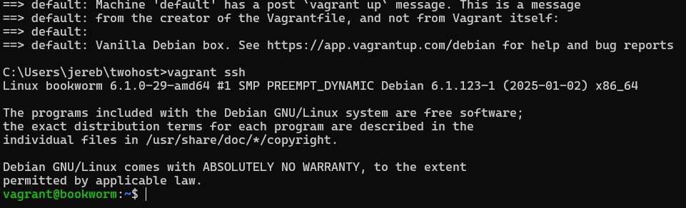
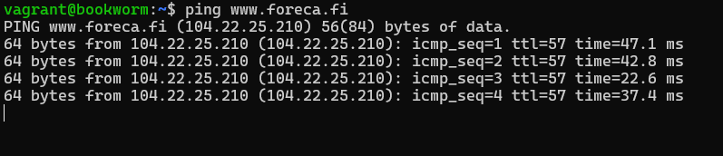
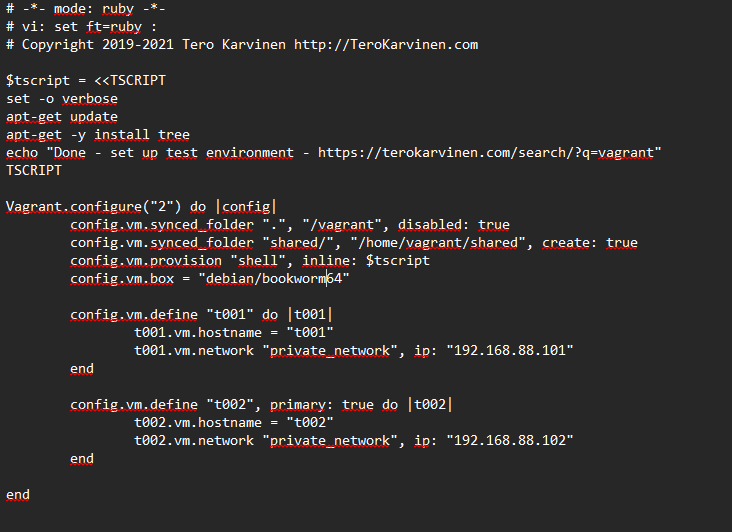
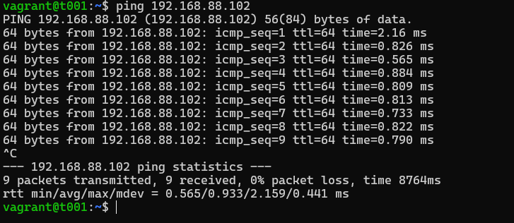
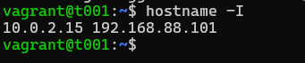
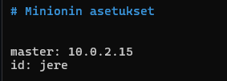
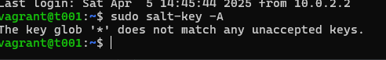

# H2 Soitto kotiin

## Käyttöympäristö

Prosessori: AMD Ryzen 5 5500H

RAM: 8 GB DDR4

Näytönohjain: NVIVIA GeForce RTX 2050

OS: Windows 10

VM: Linux Debian 12 bookworm 64-bit

## x) Lue ja tiivistä. (Tässä x-alakohdassa ei tarvitse tehdä testejä tietokoneella, vain lukeminen tai kuunteleminen ja tiivistelmä riittää. Tiivistämiseen riittää muutama ranskalainen viiva. Ei siis vaadita pitkää eikä essee-muotoista tiivistelmää.) 

###  Two Machine Virtual Network With Debian 11 Bullseye and Vagrant 

(Karvinen, T. 2021) 

Vagrant: 

- Sen avulla voidaan käynnistää kahden tietokoneen virtuaaliverkko nopeasti
- Asettaa virtuaalikoneet automaattisesti
- Mahdollistaa automaattisen ssh-kirjautumisen
- Ei tarvitse graafista käyttöliittymää

###  Salt Quickstart – Salt Stack Master and Slave on Ubuntu Linux

(Karvinen, T. 2018) 

- Saltin avulla voit hallita vaikka tuhat konetta
- Verkossa yksi master ja useita orjia eli yksi kone ohjaa kaikkia.

###  Salt Vagrant - automatically provision one master and two slaves (Kohdat: Infra as Code ja top.sls)

(Karvinen, T. 2023) 

- Infrastruktuurin tila määritellään koodina, ja se voidaan toistaa automaattisesti missä tahansa ympäristössä.
- Top.sls kertoo Saltille mitkä koneet ja tilat ajetaan.

## a) Hello Vagrant! Osoita jollain komennolla, että Vagrant on asennettu (esim tulostaa vagrantin versionumeron). Jos et ole vielä asentanut niitä, raportoi myös Vagrant ja VirtualBox asennukset. (Jos Vagrant ja VirtualBox on jo asennettu, niiden asennusta ei tarvitse tehdä eikä raportoida uudelleen.)

Minulla ei ollut vagrantia asennettuna, joten aloitin lataamalla sen Vagrantin sivuilta. Latauksen jälkeen kone piti käynnistää uudelleen. Sitten testasin, että se on ladattuna: 

## b) Linux Vagrant. Tee Vagrantilla uusi Linux-virtuaalikone.

Aloitin tekemällä uuden kansion `twohost` ja sen jälkeen tein uuden Debian virtuaalikoneen komennolla `vagrant init debian/bookworm64
` 

Seuraavaksi laitoin juuri luodun virtuaalikoneen käyntiin komennolla `vagrant up`

Uusi virtuaalikone ilmestyi nyt myös virtual boxiin: 

Seuraavaksi otin virtuaalikoneen käyttöön komennolla `vagrant ssh`: 

Sitten vielä kokeilin `ping` komentoa varmistaakseni, että kone toimii onglemitta: 

## c) Kaksin kaunihimpi. Tee kahden Linux-tietokoneen verkko Vagrantilla. Osoita, että koneet voivat pingata toisiaan. 

Aloitin siirtymällä "twohost" kansioon, jossa on `vagrantfile` tiedosto:  

    cd twohost

Seuraavaksi avasin `vagrantfile` -tiedoston ja kopion sinne (Karvinen, T. 2021) sivuilta löytyvän vagrantfile mallin kahdelle koneelle. Vaihdoin myös debianin oikeaan versioon: 

Sitten laitoin virtuaalikoneet päälle komennolla: 

        $ Vagrant up

Seuraavaksi kokeilin, että koneet voivat pingata toisiaan eli pingasin ykköskoneella kakkoskoneen ip-osoitetta: 

## d) Herra-orja verkossa. Demonstroi Salt herra-orja arkkitehtuurin toimintaa kahden Linux-koneen verkossa, jonka teit Vagrantilla. Asenna toiselle koneelle salt-master, toiselle salt-minion. Laita orjan /etc/salt/minion -tiedostoon masterin osoite. Hyväksy avain ja osoita, että herra voi komentaa orjakonetta. 

Aloitin lataamalla Saltin. Loin ensin Keyrings-hakemiston: 

        $ mkdir -p /etc/apt/keyrings 

Seuraavaksi latasin julkisen avaimen: 

        $ curl -fsSL https://packages.broadcom.com/artifactory/api/security/keypair/SaltProjectKey/public | sudo tee /etc/apt/keyrings/salt-archive-keyring.pgp

Lopuksi loin APT:n määritystiedoston

        $ curl -fsSL https://github.com/saltstack/salt-install-guide/releases/latest/download/salt.sources | sudo tee /etc/apt/sources.list.d/salt.sources

Seuraavaksi latasin master-koneelle eli `t001` salt-masterin: 

        $ sudo apt-get update
        $ sudo apt-get -y install salt-master

Lopuksi otin vielä hostnamen talteen, jotta voin yhdistää sen minun minioniin. 

Seuraavaksi siirryin minun minion koneelleni: 

        $ vagrant shh t002

Sinne loin myös luottamussuhteen saltin kanssa ja sitten asensin salt-minionin: 

        $ sudo apt-get update
        $ sudo apt-get -y install salt-minion

Seuraavaksi muokkasin minion-tiedostoa, jotta voin määrittää masterin osoitteen ja id: 

        $ sudoedit /etc/salt/minion

Sitten vielä käynnistin minionin uudelleen, jotta asetukset tulevat voimaan: 

        $ sudo systemctl restart salt-minion.service

Seuraavaksi siirryin takaisin master koneen puolelle ja kokeilin hyväksyä orjan avaimen, mutta se ei kuitenkaan onnistunut: 

## Lähteet  

- Karvinen, T. 3.4.2025. Tehtävänanto. h2 Soitto kotiin. Luettavissa: https://terokarvinen.com/palvelinten-hallinta/#h2-soitto-kotiin Luettu: 4.4.2025
- Karvinen, T. 4.11.2021. Two Machine Virtual Network With Debian 11 Bullseye and Vagrant. Luettavissa: https://terokarvinen.com/2021/two-machine-virtual-network-with-debian-11-bullseye-and-vagrant/ Luettu: 4.4.2025
- Karvinen, T. 28.3.2018. Salt Quickstart – Salt Stack Master and Slave on Ubuntu Linux. Luettavissa: https://terokarvinen.com/2018/salt-quickstart-salt-stack-master-and-slave-on-ubuntu-linux/?fromSearch=salt%20quickstart%20salt%20stack%20master%20and%20slave%20on%20ubuntu%20linux Luettu: 4.4.2025
- Karvinen, T. 28.3.2023. Salt Vagrant - automatically provision one master and two slaves. Luettavissa: https://terokarvinen.com/2023/salt-vagrant/#infra-as-code---your-wishes-as-a-text-file Luettu: 4.4.2025
