# h3 Infraa koodina

## Käyttöympäristö

Prosessori: AMD Ryzen 5 5500H

RAM: 8 GB DDR4

Näytönohjain: NVIVIA GeForce RTX 2050

OS: Windows 10

VM: Linux Debian 12 bookworm 64-bit

## a) Hei infrakoodi! Kokeile paikallisesti (esim 'sudo salt-call --local') infraa koodina. Kirjota sls-tiedosto, joka tekee esimerkkitiedoston /tmp/ -kansioon.

Tehtävää varten minulla oli jo luotuna aiempien tehtävien kaksi vagrant konetta. Ensin koneet päälle:

    $ Vagrant up

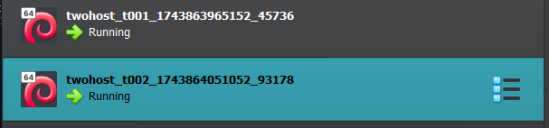

Sitten kirjauduin slave-koneelle käyttäen ssh-kirjautumista, koska tiedostot tulee ajaa paikallisesti: 

    $ vagrant ssh t002

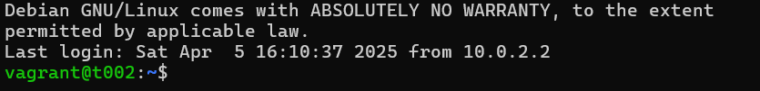

Seuraavaksi asensin micron tekstieditoriksi: 

        $ sudo apt-get -y install micro

Laitoin sen vielä oletuseditoriksi komennolla: 

        $ export EDITOR=micro

Seuraavaksi loin uuden kansion "hello"-moduulille ja siirryin sinne: 

        $ sudo mkdir -p /srv/salt/hello/
        $ cd /srv/salt/hello/

`/srv/salt` on siis kansio, joka jaetaan kaikille slave-koneille. 
Seuraavaksi itse `sls`-tiedoston tekeminen: 

Avasin tiedoston micro editorilla: 

        $ sudoedit init.sls

Loin sinne yksinkertaisen salt-koodin, joka varmistaa, että tiedosto on olemassa ja jos sitä ei ole se luodaan. 

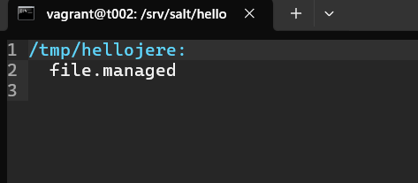

Lopuksi vielä Kokeilin toimiiko se paikallisesti: 

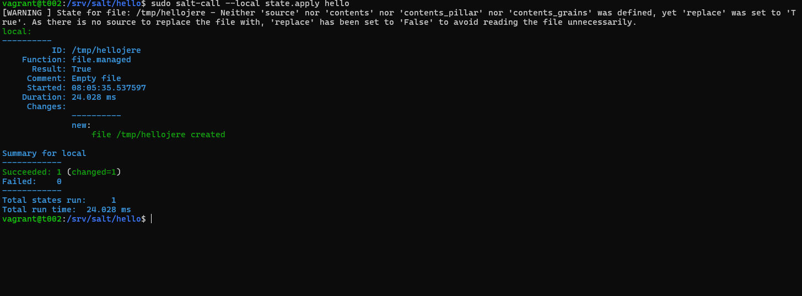

Kuvasta näkyy, että uusi tiedosto luotiin onnistuneesti. 

(Karvinen, T. 2024)

## b) Aja esimerkki sls-tiedostosi verkon yli orjalla 

Aloitin tehtävän siirtymällä master-koneen puolelle: 

        $ vagrant shh t001

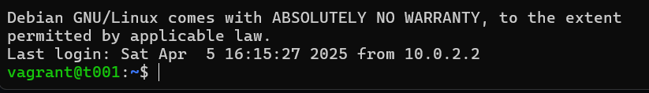

Tässä kohtaan yritin ajaa sls-tiedostoni verkon yli, mutta tajusin, että minähän tein sen vain minion koneelle aiemmassa tehtävässä. Noh.. Kertaus on opintojen äiti.

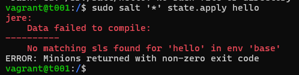
        
Tässä nyt uusi sls-tiedosto: 

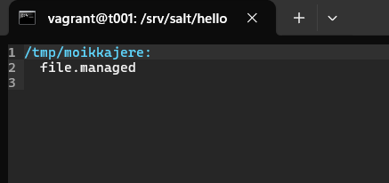

Kokeilin vielä ajaa paikallisesti: 

        $ sudo salt-call --local state.apply hello

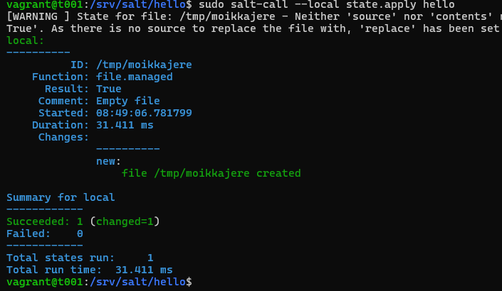

Sitten pääsin vihdoin itse asiaan. Eli suoritin komennon: 

        $ sudo salt '*' state.apply hello

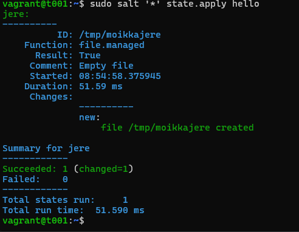

Nyt siis "moikkajere"-tiedosto pitäisi olla luotuna minion koneella. Käydäämpä tarkistamassa. 

Siirryin `tmp` kansioon ja annoin komennon `$ ls -A`

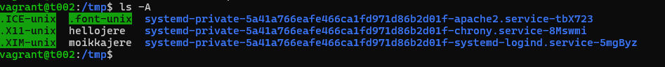

## c) Tee sls-tiedosto, joka käyttää vähintään kahta eri tilafunktiota näistä: package, file, service, user. Tarkista eri ohjelmalla, että lopputulos on oikea. Osoita useammalla ajolla, että sls-tiedostosi on idempotentti. 

Aloitin tehtävän siirtymällä master-koneelle ja sitten muokkasin aiemman tehtävän sls-tiedostoa: 

        $ vagrant ssh t001
        $ cd /srv/salt/hello
        $ sudoedit init.sls

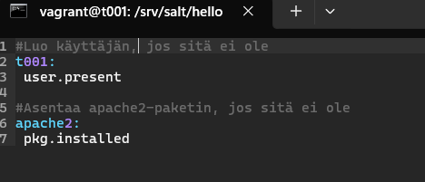

Seuraavaksi ajoin sls-tiedoston: 

        $ sudo salt '*' state.apply hello 

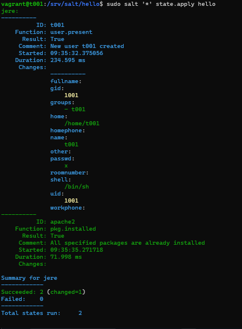
