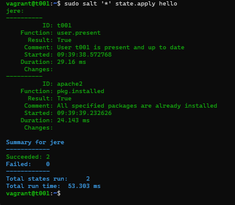

# h3 Infraa koodina

## Käyttöympäristö

Prosessori: AMD Ryzen 5 5500H

RAM: 8 GB DDR4

Näytönohjain: NVIVIA GeForce RTX 2050

OS: Windows 10

VM: Vagrant

## x) Lue ja tiivistä. (Tässä x-alakohdassa ei tarvitse tehdä testejä tietokoneella, vain lukeminen tai kuunteleminen ja tiivistelmä riittää. Tiivistämiseen riittää muutama ranskalainen viiva.) 

### Karvinen 2014: Hello Salt Infra-as-Code 

- Luo kansio moduulille `sudo mkdir -p /srv/salt/hello/`
- Kirjoita infraa koodina sls-tiedostoon `sudoedit init.sls`
- Aja moduuli ja tarkasta tulokset `sudo salt-call --local state.apply hello`
- Varmista, että tiedosto on luotu `ls /tmp/helloesimerkki`

### VMware, Inc. 2024: Salt contributors 

#### Rules of YAML
 - Data on avain-arvo-pareissa ja ne erotetaa kaksoispisteellä ja välilyönnillä `: `
 - Arvon tyyppi voi olla luku, merkkijono tai boolean
 - Tabia ei saa käyttää
#### YAML simple structure
 - Skaalarit = avain-arvo-parit, joissa on luku,merkkijono tai boolean
 - Listat = Avain, jota seuraa lista arvoista
 - Sanakirjat = Kokoelma avain-arvo -pareja ja listoja.
#### Lists and dictionaries - YAML block structures
 - YAML on järjestetty lohkoihin, joissa sisennys määrittää kontekstin
 - Sisennys tehdään yhdellä tai useammalla välilyönnillä

## a) Hei infrakoodi! Kokeile paikallisesti (esim 'sudo salt-call --local') infraa koodina. Kirjota sls-tiedosto, joka tekee esimerkkitiedoston /tmp/ -kansioon.

Tehtävää varten minulla oli jo luotuna aiempien tehtävien kaksi vagrant konetta. Ensin koneet päälle:

    $ Vagrant up

Sitten kirjauduin slave-koneelle käyttäen ssh-kirjautumista, koska tiedostot tulee ajaa paikallisesti: 

    $ vagrant ssh t002

Seuraavaksi asensin micron tekstieditoriksi: 

        $ sudo apt-get -y install micro

Laitoin sen vielä oletuseditoriksi komennolla: 

        $ export EDITOR=micro

Seuraavaksi loin uuden kansion "hello"-moduulille ja siirryin sinne: 

        $ sudo mkdir -p /srv/salt/hello/
        $ cd /srv/salt/hello/

`/srv/salt` on siis kansio, joka jaetaan kaikille slave-koneille. 
Seuraavaksi itse `sls`-tiedoston tekeminen: 

Avasin tiedoston micro editorilla: 

        $ sudoedit init.sls

Loin sinne yksinkertaisen salt-koodin, joka varmistaa, että tiedosto on olemassa ja jos sitä ei ole se luodaan. 

Lopuksi vielä Kokeilin toimiiko se paikallisesti: 

Kuvasta näkyy, että uusi tiedosto luotiin onnistuneesti. 

(Karvinen, T. 2024)

## b) Aja esimerkki sls-tiedostosi verkon yli orjalla 

Aloitin tehtävän siirtymällä master-koneen puolelle: 

        $ vagrant shh t001

Tässä kohtaan yritin ajaa sls-tiedostoni verkon yli, mutta tajusin, että minähän tein sen vain minion koneelle aiemmassa tehtävässä. Noh.. Kertaus on opintojen äiti.

        
Tässä nyt uusi sls-tiedosto: 

Kokeilin vielä ajaa paikallisesti: 

        $ sudo salt-call --local state.apply hello

Sitten pääsin vihdoin itse asiaan. Eli suoritin komennon: 

        $ sudo salt '*' state.apply hello

Nyt siis "moikkajere"-tiedosto pitäisi olla luotuna minion koneella. Käydäämpä tarkistamassa. 

Siirryin `tmp` kansioon ja annoin komennon `$ ls -A`

## c) Tee sls-tiedosto, joka käyttää vähintään kahta eri tilafunktiota näistä: package, file, service, user. Tarkista eri ohjelmalla, että lopputulos on oikea. Osoita useammalla ajolla, että sls-tiedostosi on idempotentti. 

Aloitin tehtävän siirtymällä master-koneelle ja sitten muokkasin aiemman tehtävän sls-tiedostoa: 

        $ vagrant ssh t001
        $ cd /srv/salt/hello
        $ sudoedit init.sls

Seuraavaksi ajoin sls-tiedoston: 

        $ sudo salt '*' state.apply hello 

Se onnistui ongelmitta. Lopuksi vielä kokeilin, toimiiko idempotentti: 

Idempotentti toimi mainiosti!

## Lähteet

- Karvinen, T. 3.4.2024. Hello Salt Infra-as-Code. Luettavissa: https://terokarvinen.com/2024/hello-salt-infra-as-code/ Luettu: 12.4.2025
- VMware, Inc. 2021-2024. Salt overview. Luettavissa: https://docs.saltproject.io/salt/user-guide/en/latest/topics/overview.html#rules-of-yaml Luettu: 12.4.2025
- Karvinen, T. 28.3.2018. Salt Quickstart – Salt Stack Master and Slave on Ubuntu Linux. Luettavissa: https://terokarvinen.com/2018/salt-quickstart-salt-stack-master-and-slave-on-ubuntu-linux/?fromSearch=salt%20quickstart%20salt%20stack%20master%20and%20slave%20on%20ubuntu%20linux Luettu: 12.4.2025
