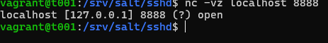

# h4 Pkg-file-service 

## Käyttöympäristö

Prosessori: AMD Ryzen 5 5500H

RAM: 8 GB DDR4

Näytönohjain: NVIVIA GeForce RTX 2050

OS: Windows 10

VM: Vagrant

## x) Lue ja tiivistä.

- Voit hallita useita taustapalveluita konfiguraationhallintajärjestelmällä
- Master-palvelimella luodaan tilatiedosto ja uusi sshd_config, jotka otetaan käyttöön slave-palvelimilla
- Tilan soveltamisen jälkeen SSH-yhteyttä voidaan testata uudella portilla varmistaen, että muutos toimii.

## a) Apache easy mode. Asenna Apache, korvaa sen testisivu ja varmista, että demoni käynnistyy. 

Aloitin tehtävän ssh-kirjautumalla viime tehtävistä valmiiksi tehdylle master-koneelle:

Koneet päälle: 

    $ vagrant up

ssh-kirjautuminen: 

    $ vagrant ssh t001

Asensin apache2-ohjelman aluksi käsin: 

    $ sudo apt-get -y install apache2

Seuraavaksi kokeilin, että testisivu on päällä: 

    $ curl localhost

Sitten korvasin, testisivun omalla sivulla. 

    $ echo "<h1>Tämä on testi</h1>" | sudo tee /var/www/html/index.html
    $ curl localhost

Nyt on tehty käsin niin seuraavaksi tehdään automatisoidusti. 

Eli loin uuden moduulin `apache`: 

    $ sudo mkdir -p /srv/salt/apache/

Ja sinne loin uuden `.sls`-tiedoston microlla: 

    $ micro apachesetti.sls

Sitten muokkasin .sls-tiedoston seuraavanlaiseksi: 

Seuraavaksi yritin ajaa tiedostoa: 

    $ sudo salt '*' state.apply apache.apachesetti

Mutta sain kuitenkin seuraavan virheviestin: 

Korjasin virheen poistamalla kaksoispisteen `pkg.installed` perästä: 

Sitten kokeilin ajaa uudestaa: 

Se näytti toimivan hyvin. Kokelin vielä toimiiko hommat minion-koneella: 

Sekin toimi ongelmitta!

En ollut kuitenkaan varma teinkö tehtävän oikein, sillä en varsinaisesti korvannut testitiedostoa vaan muokkaisin sitä. 

## b) SSHouto. Lisää uusi portti, jossa SSHd kuuntelee.

Aloitin tehtävän tekemällä uuden moduulin `sshd`: 

    $ sudo mkdir -p /srv/salt/sshd

Ja loin uuden `.sls`-tiedoston, jota muokkasin seuraavasti: 

    $ micro init.sls

Seuraavaksi tein config-tiedoston: 

    $ cd /srv/salt/sshd/
    $ micro sshd_config

Ja Laitoin sisällöksi saman mitä [Karvinen, T](https://terokarvinen.com/2018/04/03/pkg-file-service-control-daemons-with-salt-change-ssh-server-port/?fromSearch=karvinen%20salt%20ssh) -sivuilla oli, mutta lisäsin myös oman portin, koska teen vagrantilla:

        
Seuraavaksi testasin ajaa sen paikallisesti: 

    $ sudo salt-call --local state.apply sshd

 

 Lopuksi vielä testasin uutta porttia. 

    $ nc -vz localhost 8888 

Portti on auki eli kaiken pitäisi nyt ymmärtääkseni toimia.

## Lähteet

- Karvinen, T. 2025. Tehtävänanto. h4 Pkg-file-service. Luettavissa: https://terokarvinen.com/palvelinten-hallinta/#h4-pkg-file-service Luettu: 20.4.2025
- Karvinen, T. 3.4.2024. Hello Salt Infra-as-Code. Luettavissa: https://terokarvinen.com/2024/hello-salt-infra-as-code/ Luettu: 20.4.2025
