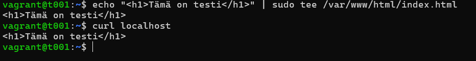
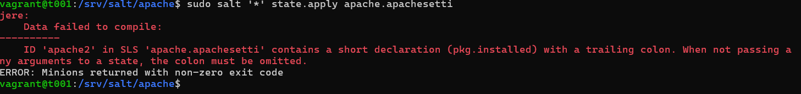

# h4 Pkg-file-service 

## a) Apache easy mode. Asenna Apache, korvaa sen testisivu ja varmista, että demoni käynnistyy. 

Aloitin tehtävän ssh-kirjautumalla viime tehtävistä valmiiksi tehdylle master-koneelle:

Koneet päälle: 

    $ vagrant up

ssh-kirjautuminen: 

    $ vagrant ssh t001

Asensin apache2-ohjelman aluksi käsin: 

    $ sudo apt-get -y install apache2

Seuraavaksi kokeilin, että testisivu on päällä: 

    $ curl localhost

Sitten korvasin, testisivun omalla sivulla. 

    $ echo "<h1>Tämä on testi</h1>" | sudo tee /var/www/html/index.html
    $ curl localhost

Nyt on tehty käsin niin seuraavaksi tehdään automatisoidusti. 

Eli loin uuden moduulin `apache`: 

    $ sudo mkdir -p /srv/salt/apache/

Ja sinne loin uuden `.sls`-tiedoston microlla: 

    $ micro apachesetti.sls

Sitten muokkasin .sls-tiedoston seuraavanlaiseksi: 

Seuraavaksi yritin ajaa tiedostoa: 

    $ sudo salt '*' state.apply apache.apachesetti

Mutta sain kuitenkin seuraavan virheviestin: 

Korjasin virheen poistamalla kaksoispisteen `pkg.installed` perästä: 

Sitten kokeilin ajaa uudestaa: 

Se näytti toimivan hyvin. Kokelin vielä toimiiko hommat minion-koneella: 

Sekin toimi ongelmitta!

En ollut kuitenkaan varma teinkö tehtävän oikein, sillä en varsinaisesti korvannut testitiedostoa vaan muokkaisin sitä. 

## b) SSHouto. Lisää uusi portti, jossa SSHd kuuntelee.

Aloitin tehtävän tekemällä uuden moduulin `sshd`: 

    $ sudo mkdir -p /srv/salt/sshd

Ja loin uuden `.sls`-tiedoston, jota muokkasin seuraavasti: 

    $ micro init.sls

Seuraavaksi tein config-tiedoston: 

    $ cd /srv/salt/sshd/
    $ micro sshd_config

Ja Laitoin sisällöksi saman mitä (Karvinen, T) sivuilla oli, mutta lisäsin myös oman portin:

        
Seuraavaksi testasin ajaa sen paikallisesti: 

    $ sudo salt-call --local state.apply sshd

 
