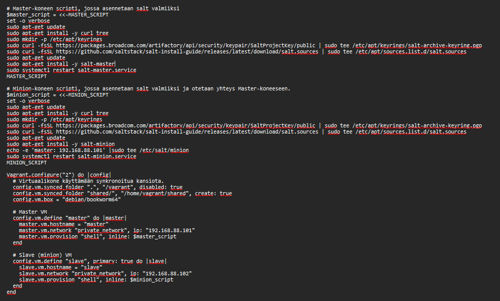

# h5 Miniprojekti 

## Käyttöympäristö

Prosessori: AMD Ryzen 5 5500H

RAM: 8 GB DDR4

Näytönohjain: NVIVIA GeForce RTX 2050

OS: Windows 10

VM: Vagrant

## Miniprojekti

Aluksi mietin minkä tyyppisen projekin voisin tehdä. Halusin, että aihe liittyy peleihin tai elokuviin. Päätin ideoida tekoälyn kanssa ja lopulta päädyin valitsemaan aiheeksi elokuva triviapelin. Se tulee toimimaan saltin avulla, pelissä 2 tai useampi pelaaja(VM) kilpailevat toisiaan vastaan arvaamalla elokuvia eri kysymysten mukaan. 

## Koneidein asennus

Ensiksi laitoin koneet pystyyn luomalla vagrantfilen: 

Sitten kokeilin käynnistää: 

    $ vagrant up

Sitten vielä kirjauduin masterille ssh-yhteydellä: 

    $ vagrant ssh master

Seuraavaksi yritin pingata slave-konetta: 

Seuraavaksi piti hyväksyä slave-koneen avain: 

    $ sudo salt-key -L

    $ sudo salt-key -A

Lopuksi vielä ping-testi, että kaikki toimii varmasti tähän asti: 

    $ sudo salt '*' test.ping

## Lokaalitestaus minionilla

Aloitin luomalla uuden kansion: 

    $ sudo mkdir -p /srv/salt
    $ sudo nano /srv/salt/install_python.sls

Tein yksinkertaisen tiedoston jonka pitäisi asentaa python: 

Lopuksi vielä ajoin lokaalisti, nähdäkseni tuleeko mitään ongelmia: 

    $ sudo salt-call --local state.apply install_python

## Mestarilta orjalle

Seuraavaksi testasin voiko saman toteuttaa master-koneella ja sitten käskeä orja tekemään sama toiminto. Tein saman nimisen tiedoston myös master-koneelle ja kokelin ajaa sen saltin yli: 

    $ sudo salt 'slave' state.apply install_python

