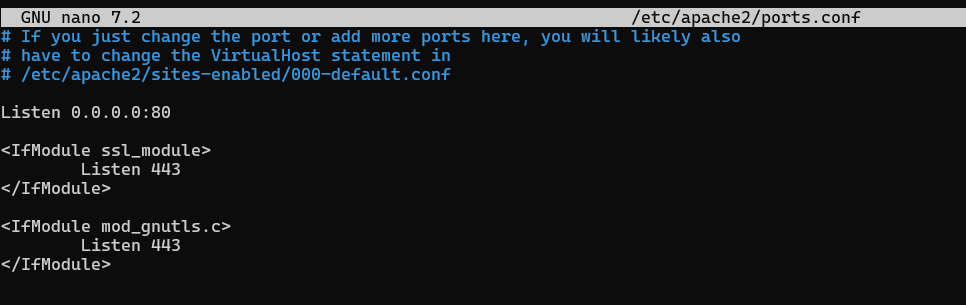

# h5 Miniprojekti 

## Käyttöympäristö

Prosessori: AMD Ryzen 5 5500H

RAM: 8 GB DDR4

Näytönohjain: NVIVIA GeForce RTX 2050

OS: Windows 10

VM: Vagrant

## Miniprojekti

Aluksi mietin minkä tyyppisen projekin voisin tehdä. Halusin, että aihe liittyy peleihin tai elokuviin. Päätin ideoida tekoälyn kanssa ja lopulta päädyin valitsemaan aiheeksi elokuva triviapelin. Se tulee toimimaan saltin avulla, pelissä 2 tai useampi pelaaja(VM) kilpailevat toisiaan vastaan arvaamalla elokuvia eri kysymysten mukaan. 

## Koneidein asennus

Ensiksi laitoin koneet pystyyn luomalla vagrantfilen: 

    # Master-koneen scripti, jossa asennetaan salt valmiiksi
    $master_script = <<-MASTER_SCRIPT
    set -o verbose
    sudo apt-get update
    sudo apt-get install -y curl tree
    sudo mkdir -p /etc/apt/keyrings
    sudo curl -fsSL https://packages.broadcom.com/artifactory/api/security/keypair/SaltProjectKey/public | sudo tee /etc/apt/keyrings/salt-archive-keyring.pgp
    sudo curl -fsSL https://github.com/saltstack/salt-install-guide/releases/latest/download/salt.sources | sudo tee /etc/apt/sources.list.d/salt.sources
    sudo apt-get update
    sudo apt-get install -y salt-master
    sudo systemctl restart salt-master.service
    MASTER_SCRIPT
    
    # Minion-koneen scripti, jossa asennetaan salt valmiiksi ja otetaan yhteys Master-koneeseen.
    $minion_script = <<-MINION_SCRIPT
    set -o verbose
    sudo apt-get update
    sudo apt-get install -y curl tree
    sudo mkdir -p /etc/apt/keyrings
    sudo curl -fsSL https://packages.broadcom.com/artifactory/api/security/keypair/SaltProjectKey/public | sudo tee /etc/apt/keyrings/salt-archive-keyring.pgp
    sudo curl -fsSL https://github.com/saltstack/salt-install-guide/releases/latest/download/salt.sources | sudo tee /etc/apt/sources.list.d/salt.sources
    sudo apt-get update
    sudo apt-get install -y salt-minion
    echo -e 'master: 192.168.88.101' |sudo tee /etc/salt/minion
    sudo systemctl restart salt-minion.service
    MINION_SCRIPT
    
    Vagrant.configure("2") do |config|
      # Virtuaalikone käyttämään synkronoitua kansiota.
      config.vm.synced_folder ".", "/vagrant", disabled: true
      config.vm.synced_folder "shared/", "/home/vagrant/shared", create: true
      config.vm.box = "debian/bookworm64"
    
      # Master VM
      config.vm.define "master" do |master|
        master.vm.hostname = "master"
        master.vm.network "private_network", ip: "192.168.88.101"
        master.vm.provision "shell", inline: $master_script
      end
    
      # Slave (minion) VM
      config.vm.define "slave", primary: true do |slave|
        slave.vm.hostname = "slave"
        slave.vm.network "private_network", ip: "192.168.88.102"
        slave.vm.provision "shell", inline: $minion_script
      end
    end

Sitten kokeilin käynnistää: 

    $ vagrant up

Sitten vielä kirjauduin masterille ssh-yhteydellä: 

    $ vagrant ssh master

Seuraavaksi yritin pingata slave-konetta: 

Seuraavaksi piti hyväksyä slave-koneen avain: 

    $ sudo salt-key -L

    $ sudo salt-key -A

Lopuksi vielä ping-testi, että kaikki toimii varmasti tähän asti: 

    $ sudo salt '*' test.ping

## Lokaalitestaus minionilla

Aloitin luomalla uuden kansion: 

    $ sudo mkdir -p /srv/salt
    $ sudo nano /srv/salt/install_python.sls

Tein yksinkertaisen tiedoston jonka pitäisi asentaa python: 

Lopuksi vielä ajoin lokaalisti, nähdäkseni tuleeko mitään ongelmia: 

    $ sudo salt-call --local state.apply install_python

## Mestarilta orjalle

Seuraavaksi testasin voiko saman toteuttaa master-koneella ja sitten käskeä orja tekemään sama toiminto. Tein saman nimisen tiedoston myös master-koneelle ja kokelin ajaa sen saltin yli: 

    $ sudo salt 'slave' state.apply install_python

## Pelin rakennus

Seuraavaksi lähdin luomaan itse peliä. Ensiksi halusin, että pelin pystyy ladata kuka vain, joten vagrantfilen master-koneen synkronointiin piti tehdä pieni lisäys:

Eli lisäsin kohdan `master.vm.synced_folder "salt/", "/srv/salt", owner: "root", group: "root"`

      # Master VM
      config.vm.define "master" do |master|
        master.vm.hostname = "master"
        master.vm.network "private_network", ip: "192.168.88.101"
        master.vm.synced_folder "salt/", "/srv/salt", owner: "root", group: "root"
        master.vm.provision "shell", inline: $master_script
      end

### Rakenteen suunnittelu

Eli seuraavaksi suunnittelin tekoälyn kanssa rakenteen pelille. Tarkoituksena oli tehdä elokuvatrivia-peli, jossa käyttäjä saa monivalitakysymyksen ja oikeasta vastauksesta saa pisteen, jotka lasketaan yhteen pelin edetessä. Rakenne lyhyesti: 

- app.py: Flask sovelluksen pääohjelma, joka: 
  - Hallinnoi peli-istuntoa
  - Näyttää lomakkeen pelaajalle
  - Tarkistaa vastauksen
  - Näyttää palautteen ja lopputuloksen
- html-pohjat:
  - quiz.html: painikkeet vaihtoehdoille
  - feedback.html: näyttää menikö vastaus oikein
  - result.html: näyttää lopulliset pisteet ja mahdollisuuden aloittaa uudelleen
- init.sls: Saltin pääkonfiguraatiotiedosto, joka kertoo mitä asennetaan ja mihin:
   - Asentaa Apache2, WSGI-moduulin ja Flaskin
   - Kopioi trivia-pelin tiedostot oikeaan hakemistoon `/var/www/trivia`
   - Ottaa käyttöön oman `trivia.conf`-sivuston
   - Poistaa Apachen oletussivun `000-default.conf`
   - Käynnistää Apache-palvelun
- top.sls: Saltin "reittikartta", joka määrittää mitä tiloja (init.sls) ajetaan mille koneille.
- trivia.wsgi: WSGI-käynnistystiedosto, jota Apache käyttää Flask-sovelluksen ajamiseen.

#### app.py luominen

Siirryin master koneelle johon loin uuden kansion `trivia`

    $ mkdir trivia

Seuraavaksi tein uuden tiedoston `app.py`, jonka tarkoitus on hallinnoida sessiota:

    $ micro app.py

Pyysin chatGPT:ltä apua tiedoston sisällön luonnissa. Lopputulos näytti tältä: 

#### Html-pohjat

Seuraavaksi loin html-pohjat ja tätä varten tein uuden kansion `trivia`-kansion sisälle nimeltä `templates`:

    $ mkdir templates

Ensin `quiz.html`, jossa näytetään itse pelikysely: 

    $ micro quiz.html

Seuraavaksi loin `result.html`, joka näyttää tuloksen ja mahdollistaa uudelleen pelaamisen:

    $ micro result.html

Lopuksi vielä `feedback.html`, joka kertoo pisteytyksestä: 

    $ micro feedback.html

#### Flask, apache ja saltilla hallinta

Seuraavaksi piti yhdistää Flask ja Apache toimimaan yhdessä. Tätä varten loin uuden tiedoston `trivia.wsgi`, joka on siis toimii ns. sillanrakentaja Apachen ja Flaskin välillä. Loin ensin tiedoston: 

    $ micro trivia.wsgi
    

Seuraavaksi conffi-tiedosto, jotta saadaan Apache toimimaan oikeassa paikassa tätä varten tein uuden kansion ja sen sisälle itse tiedoston: 

    $ mkdir /trivia/apache2
    $ micro trivia.conf

Lopuksi vielä itse `ìnit.sls`, jotta saadaan sovellusten asennus automaattiseksi. Vielä kertaukseksi tänne tulee: 

- Asennetaan Apache2, mod_wsgi ja Flask
- Kopioidaan sovelluksen kaikki tiedostot VM:lle
- Otetaan trivia.conf käyttöön (a2ensite)
- Poistetaan Apachen oletussivusto (a2dissite)
- Varmistetaan että Apache-palvelu on päällä 

Loin `init.sls`- tiedoston `/salt/`-kansion alle: 

        $ cd /srv/salt/
        $ micro init.sls

Nyt pitäisi olla kaikki palaset valmiina ja päästään testailemaan tätä käytännössä.

## Testailua

Nyt kaikki pitäisi olla sillä mallilla, että ohjelman voi ajaa. Kaikki luomat tiedostot tallentuvat master-koneelle, koska se on synkronoitu vagrantfilessa `salt/`-kansioon. Yritin testata, mutta aluksi Flaskin asennus epäonnistui, joten muokkasin `init.sls`-tiedostoa siten, että se lataa `python3-flask` ja myös apachen default-sivu tuli näkyviin, joten `ìnit.sls`-tiedostoa piti myös muokata siten, että default-sivu laitetaan pois päältä. Unohdin ottaa kuvia näistä virheistä. Lopulta kuitenkin kokeilin ajaa ohjelman ja sain sen toimimaan: 

    $ sudo salt '*' state.apply

Sitten siirryin selaimessa `http://192.168.88.10` ja katsoin toimiiko sivu: 

Sivut toimivat oikein hyvin. Ei se kaunis ole, mutta toimii. 

Lopuksi vielä testasin tuhota koneet ja testata toimiiko se myös sen jälkeen. 

    $ vagrant destroy
    $ vagrant up
    $ vagrant ssh master
    # Hyväksytään avain:
    $ sudo salt-key -L
    $ sudo saltkey -A

Seuraavaksi ajo: 

    $ sudo salt '*' state.apply

`init.sls`-tiedoston ajo onnistui ja seuraavaksi tarkistin toimiiko osoite: `http://192.168.88.10`, mutta sivu ei kuitenkaan latautunut. Päätin kokeilla vaihtaa slave-koneella portin, jotta se pakottaa IPv4 kuuntelun: 

ja lopuksi vielä: 

    $ sudo systemctl restart apache2 

Nyt homma taas toimi, mutta en halunnut samaa ongelmaa jatkossa, joten homma piti automatisoida.

Muutin `init.sls`-tiedostoa vielä näin: 

## Lähteet 

- Karvinen, T. 4.11.2024. Two Machine Virtual Network With Debian 11 Bullseye and Vagrant. Luettavissa: https://terokarvinen.com/2021/two-machine-virtual-network-with-debian-11-bullseye-and-vagrant/ Luettu: 3.5.2025
- jerebjo. 2025. h2 soittokotiin. Luettavissa: https://github.com/jerebjo/Palvelinten-hallinta/blob/main/h2%20soitto%20kotiin.md Luettu: 3.5.2025
- 

